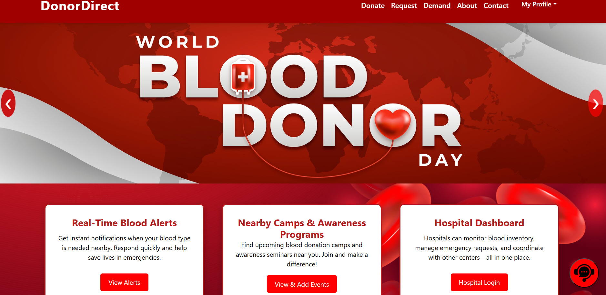

# 🩸 Smart Blood Banking System

A modern full-stack web platform that revolutionizes blood donation and distribution by connecting donors, recipients, and hospitals in real time.  
It not only manages requests and inventories but also **automatically assigns the nearest hospital** to a recipient, sends notifications, and generates **secure certificates** upon successful donation completion — ensuring trust, transparency, and security.

---

## 🚀 Tech Stack

| Layer             | Tools & Frameworks |
|-------------------|--------------------|
| **Frontend**      | React.js • HTML5 • CSS3 • JavaScript (ES6+) • Axios • Bootstrap/Tailwind |
| **Backend**       | Node.js • Express.js • MongoDB • JWT Authentication • REST APIs |
| **Machine Learning** | Python • pandas • NumPy • scikit-learn • Flask |
| **Real-Time Features** | Socket.IO • WebSockets |
| **Security**      | bcrypt • HTTPS • JWT Tokens |
| **Other Tools**   | Postman • Git/GitHub • Figma (UI/UX) |

---

## 🧩 Problem Statement

Traditional blood-bank systems face:
- **Delayed communication** between donors, recipients, and hospitals.
- **No real-time tracking** of availability and requests.
- **Lack of trust & verification** for donors and recipients.
- **No predictive capability** to avoid shortages.

---

## 🎯 Objectives

- Create a **centralized system** for hospitals to receive and process blood requests securely.
- **Track and update inventories in real time** with instant alerts for shortages.
- **Automatically assign the nearest hospital** to the recipient at the time of booking.
- **Generate digital certificates** after hospitals confirm donation completion.
- Integrate **machine learning** to forecast blood demand by group and location.
- Increase **trust & transparency** by allowing hospitals to verify and manage requests directly.

---

## 🔑 Core Features

- 🏥 **Hospital Registration & Government ID-Based Login**  
  Hospitals can securely log in using their assigned government-issued Hospital ID.

- 📥 **Blood Unit Booking with Auto Hospital Assignment**  
  When a recipient books blood, the system automatically assigns the nearest hospital.

- 📦 **Real-Time Inventory & Case Management**  
  Hospitals can see booked cases, available beds, and free room numbers.

- 📜 **Digital Certificate Generation**  
  Once a donation is marked as 'Completed' by the hospital, a digital certificate is generated for the donor.

- 📈 **AI-Driven Demand Forecasting**  
  Machine learning predicts upcoming demand based on historical trends.

- 🔔 **Instant Notifications**  
  Automatic message alerts are sent to donors and recipients upon booking or updates.

- 🔐 **Enhanced Security & Trust**  
  Hospital verification ensures no fraudulent bookings.

---

## 📊 Machine Learning Component

- Model trained using **pandas**, **NumPy**, and **scikit-learn**.
- Predicts **future blood demand** for specific blood groups and locations.
- Flask API integration to serve ML predictions to the frontend dashboard.

---

## 🖥️ Hospital Dashboard

- **Name & ID Display** – Shows hospital details after login.
- **Incoming Requests Table** – Displays all recipients assigned to that hospital.
- **Inventory Overview** – Blood units available per group.
- **Bed & Room Tracking** – Shows the number of available beds and free rooms.
- **Mark Case Complete** – Once marked, donation status updates and certificate is issued.

---

## 📌 Planned Enhancements

- 📍 Geo-based donor alerts for critical shortages.
- 📱 Mobile app integration for donors and recipients.
- 📡 Blockchain-based donation history for absolute transparency.

---

## 📷 Screenshots


---

## ⚙️ Installation & Setup

```bash
# Clone the repository
git clone https://github.com/yourusername/SMART-BLOOD-BANKING.git

# Navigate to the project directory
cd SMART-BLOOD-BANKING

# Install dependencies for frontend
cd client
npm install

# Install dependencies for backend
cd ../server
npm install

# Run the development servers
npm run dev
